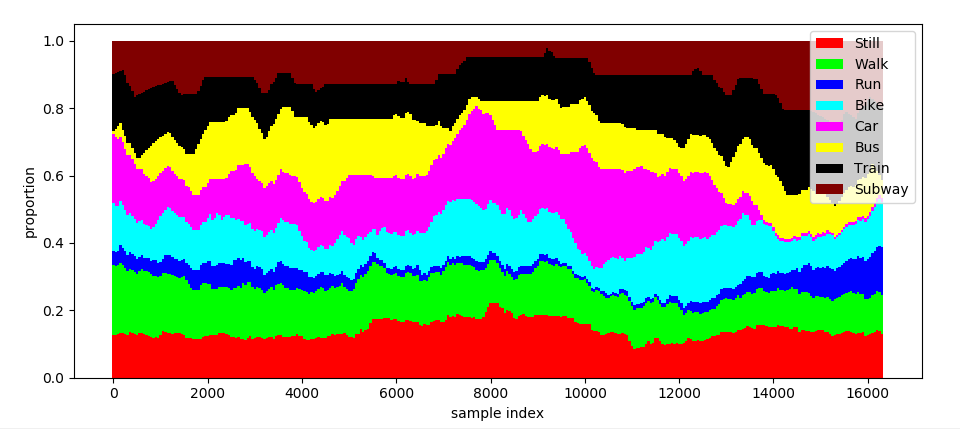
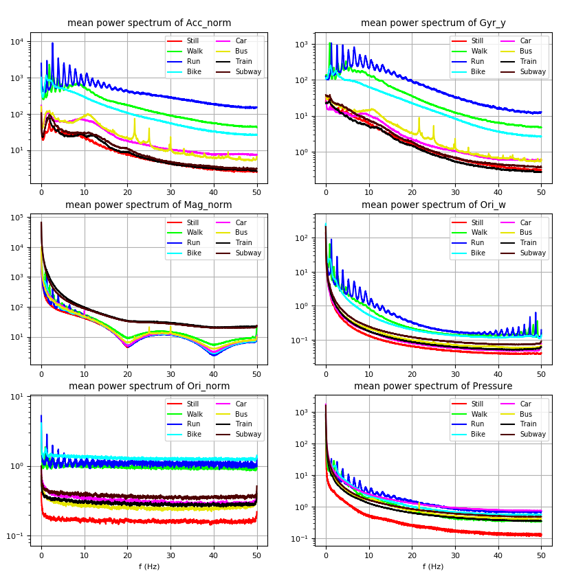
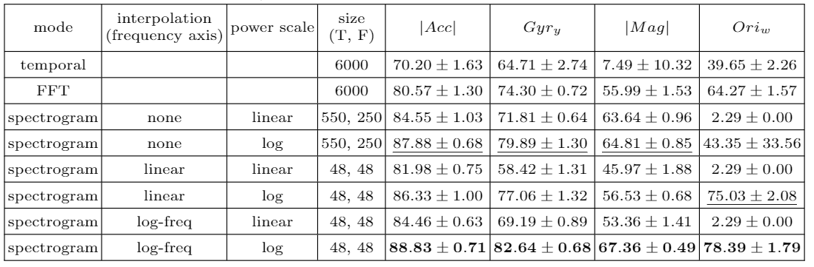
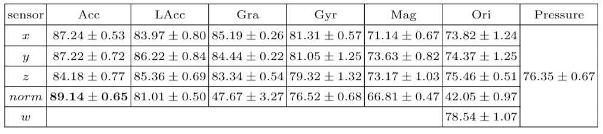
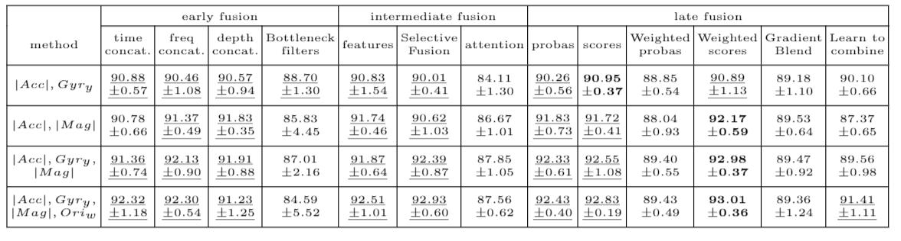

# Data Fusion for Deep Learning on Transport Mode Detection: A Case Study
This repository contains the code for the publication "Data Fusion for Deep Learning on Transport Mode Detection: A Case Study". You will find all the code for preprocessing, network training, and figure display.

## Versions used: 
- Pytorch 1.5
- numpy 1.17
- scipy 1.3.1
- sklearn 0.23.2 (f1_score and confusion matrix)
- matplotlib 3.1.3

## How to use: 
- Download the official SHL 2018 dataset at http://www.shl-dataset.org/activity-recognition-challenge/
- Write the location of the data in your computer in param.py
- Launch the script preprocess/reorder.py once. It will reorder the samples chronologically, and store them in a compressed `.pickle` file (~x2 memory gain, from 20Go to 10Go, and faster loading times). At this point, the original .txt files are only needed for unit tests in `preprocess/Datasets.py`, they can be deleted to free some memory
- The experiments can now be launched from the `main_shl.py` script. Most files also contain unit tests or basic displays that can be accessed by executing them directly (as opposed to importing them). Feel free to explore and experiment !

## Contents
The code is organized as follows:
- **preprocess** contains the structures to reorder the samples in a chronological order  \(`reorder.py`\), data loading \(`Datasets.py`\), spectrogram computation and interpolation to create a mel axis for the frequencies \(`transforms.py`\). 
- **architectures** contains all the codes implementing all the different neural networks and fusion modes. All fusion models either inherit from or rely on the baseline CNN \(`basic_CNN.py`\), which itself inherits from a helper class defined in `base_network.py`. 
- **external_repositories** contains files from other repositories that I copied here for convenience: [SVCCA](https://github.com/google/svcca/blob/master) and [deepCCA](https://github.com/Michaelvll/DeepCCA). I do not claim autorship of any of the file in this directory. Both repositories were used to try to produce networks that were forced to produce complementary features. As these networks did not have better accuracy than the thers, we did not talk about them in the publication, cut the code is available in `architecture\dissimilar_nets.py`. 
- **vizualisations** contains basic scripts which show the importance of our val/train splitting \(`classes.py`\), and a display of the average power spectrum per class \(`frequencies.py`\) 

## Results
Here are the main numerical results we obtained: 
- A benchmark of the preprocessing methods:

- A benchmark of the different sensors:

- A comparison of the fusion modes:

## Reference
This code was used to produce an accepted publication in EANN 2021, the reference will be available soon. 

